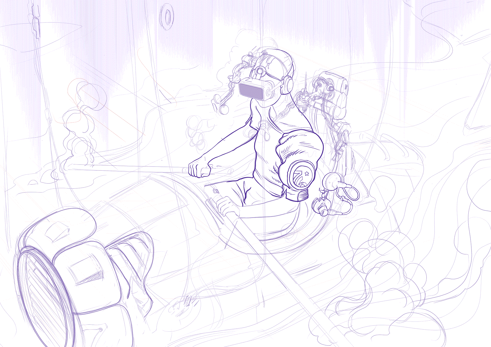

# alternate Y2K20
:new_moon: this is the Jekyll theme used for [@alternatyves](https://alternatyves.com) portfolio site



To check the Jekyll theme minus content, go to: [Theme demo](https://yjpl.github.io/alternate/)

## Features
- [x] Image index start page
- [x] Blog
- [x] [jekyll-archives](https://github.com/jekyll/jekyll-archives) to build and sort through categories & tags pages
- [x] RSS/Atom feed
- [x] SEO tags
- [x] Microdata markup
- [x] Jekyll `livereload` + NPM for fast development
- [x] Built-in site search (does not work with GitHub Pages)


## Get Started

Install [Jekyll](https://jekyllrb.com/docs/installation/)

```
git clone git://github.com/YJPL/alternate.git
cd alternate
(npm install tachyons)
npm start
```
That should do the trick.
Add your site and author details in `_config.yml`.
Get a workflow going to see your site's output with Jekyll locally using Jekyll commands or Gulp.

Then open another tab in terminal and run

```
bundle exec jekyll serve --watch
```

This will build the site.

This sets up a Jekyll server for dev on port 4000. The site is regenerated every time you save a file.
NOTE: Changing ```_config.yml``` will require a restart of the Jekyll server to see changes.

To restart server, go to terminal tab that server is running in then press

`ctrl+C ⇧  enter`
then

To fire Jekyll with auto-regeneration, use:

`npm run start`

This runs a series of tasks: minifies CSS, images and Javascript.

This command builds the site locally on port 4000, with livereload so you can quickly revise design changes.


## Responsive images
For a portfolio, this aspect is important. Resized images are served by the [jekyll-picture-tag](https://github.com/rbuchberger/jekyll_picture_tag) plugin to `_site/images/generated`

The site also use a custom ruby plugin that will replace Markdown images eg. `` with `` tag

It means that you no longer need to write special markup for responsive image such as ``, and that, should you stop using the picture tag plugin, the site images would not break (assuming you keep the little `img_tag_transform.rb` ruby plugin in place, otherwise you’d need to write `` for the images to display.

Make sure there there is no space in image names!!!

## Site Structure

In Terminal, CD `alternate` then run `Tree` to get a directory tree of the site files.

## Notes
Blog posts are in `alternate/_posts/`
There are three layouts, one for posts, one for other pages, and one for long form articles. Layouts are stored
in `alternate/_layouts/` Folders that begin with an underscore are not copied over to
`_site`. The home page has its own layout (root index.html file). Drafts are used for development & testing purpose.

## Develop

### Building front-end assets: styles and scripts

Install Node module dependencies:

~~~bash
npm install
~~~


### Tachyons

You can change the site styling using [Tachyons](http://tachyons.io), look for the CSS in the `sup-theme` file, located in the `src` folder.

Tachyons is a CSS toolkit and design system based on using components. Please refer to [Tachyons documentation](http://tachyons.io/docs/), you can also start with [https://github.com/dwyl/learn-tachyons](https://github.com/dwyl/learn-tachyons)

Once you are done with your style changes, run:

Run the npm run 
~~~bash
build:css
~~~

That will process all your CSS files in one readable file located in `assets/css/alt-tachyons.css`. 

to minify your css you can run 

```
npm run minify-css
```

or 

```
npm run start
```

to minify and build the site locally.


### npm commands with browser reload

Supply uses a couple of custom Postcss npm scripts. Make sure your dependencies are installed: `npm install`. Type `npm outdated` to see if you have outdated versions, then install any outdated dependencies.

Once that is done, to build your site & concatenate your CSS (in `assets` -> `CSS`), simply run:

```
npm run start
```

This command builds the site locally on port 4000, you can quickly revise design changes thanks to `livereload`.
## Editing

### Posts

* Add, update, or remove a post in the *Posts* collection.
* Change the defaults when new posts are created in `_posts/_defaults.md`.

## Collections

Read about [collections](https://jekyllrb.com/docs/collections/) in the Jekyll documentation.

# Credits & thanks

Build with [Jekyll](https://jekyllrb.com) loosely based on [JKL + TACHYONS](https://github.com:mrmrs/jkl-tachyons), (c) 2015 @mrmrs

Thanks to [GitHub](https://github.com/) for code versioning and to [Netlify](https://www.netlify.com) for deployment and content delivery.

# Copyright / License

The content of this project itself, all illustrations & design works are (c) Yves JPL Capelle / [alternate outc.](https://alternatyves.com) / SOFAM. The underlying source code used to format and display that content is licensed under the MIT license.

# License

The MIT License (MIT)

Copyright (c) 2020-2024 @YJPL

Permission is hereby granted, free of charge, to any person obtaining a copy
of this software and associated documentation files (the "Software"), to deal
in the Software without restriction, including without limitation the rights
to use, copy, modify, merge, publish, distribute, sublicense, and/or sell
copies of the Software, and to permit persons to whom the Software is
furnished to do so, subject to the following conditions:

The above copyright notice and this permission notice shall be included in
all copies or substantial portions of the Software.

THE SOFTWARE IS PROVIDED "AS IS", WITHOUT WARRANTY OF ANY KIND, EXPRESS OR
IMPLIED, INCLUDING BUT NOT LIMITED TO THE WARRANTIES OF MERCHANTABILITY,
FITNESS FOR A PARTICULAR PURPOSE AND NON INFRINGEMENT. IN NO EVENT SHALL THE
AUTHORS OR COPYRIGHT HOLDERS BE LIABLE FOR ANY CLAIM, DAMAGES OR OTHER
LIABILITY, WHETHER IN AN ACTION OF CONTRACT, TORT OR OTHERWISE, ARISING FROM,
OUT OF OR IN CONNECTION WITH THE SOFTWARE OR THE USE OR OTHER DEALINGS IN
THE SOFTWARE.
